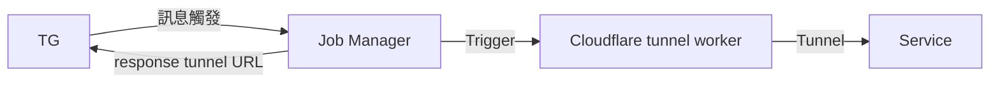

# Tunnel Worker Controller

## Purpose

在 Kubernetes 內為透過 `cloudflared tunnel` 為指定服務動態的搭建一個 `*.trycloudflare.com` 的 `臨時安全通道`，無需永久暴露服務端口，並且在一定時間後會自動銷毀



## Installation

```bash
helm repo add tunnel-worker-controller https://sakuard.github.io/tunnel-worker-controller
helm install tunnel-manager tunnel-worker-controller/tunnel-worker-controller
```

## Configuration

### Required Values
- `TG_BOT_TOKEN`: Telegram bot token
- `TG_CHAT_ID`: Telegram chat ID

### Setup Method
Currently supports **External Secrets Operator** only.

```yaml
# values.yaml example
env:
  secretName: cloudflared-tunnel
  keys:
    - TG_BOT_TOKEN
    - TG_CHAT_ID

createExternalSecret:
  refreshInterval: 1m
  name: cloudflared-tunnel
  secretStoreRef: 
    name: your-secret-store
    kind: ClusterSecretStore
```

## Usage

### Format
```
serviceName:time
```

### Examples
```
grafana:30m
grafana:1h
grafana:30s
```

### Supported Services
- `grafana` - kube-prometheus-stack grafana only

### Time Format
- `xs` - seconds
- `xm` - minutes  
- `xh` - hours

## Features

✅ TG-Bot：允許藉由 TG Bot 觸發建立 `cloudflared tunnel`
