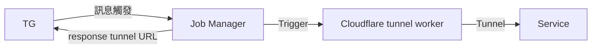

# Tunnel Worker Controller

## Purpose

在 Kubernetes 內為透過 `cloudflared tunnel` 為指定服務動態的搭建一個 `*.trycloudflare.com` 的 `臨時安全通道`，無需永久暴露服務端口，並且在一定時間後會自動銷毀

## feature

✅ TG-Bot：允許藉由 TG Bot 觸發建立 `cloudflared tunnel`
